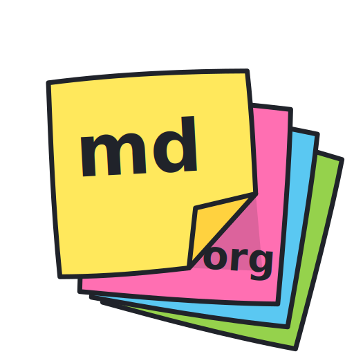

<p align="center">
  
</p>

<h1 align="center">StickiesMd</h1>

<p align="center">A file-linked sticky note app for Markdown and Org-mode, built with Electron + TypeScript + CodeMirror 6.</p>

## Features

- **Frameless transparent windows** with always-on-top and mouse-through mode
- **Markdown & Org-mode** syntax highlighting with inline image display
- **File synchronization** — edit in Emacs/VS Code and see changes instantly
- **Per-note settings** — background color, font color, opacity, line numbers
- **6 classic sticky colors** — Yellow, Blue, Green, Pink, Purple, Gray

## Development

### Prerequisites

- Node.js 22+
- npm

### Setup

```bash
npm install
```

### Run in development mode

```bash
npm run dev
```

### Lint & Format

```bash
npm run lint          # ESLint
npm run format:check  # Prettier check
npm run format        # Prettier fix
npm run typecheck     # TypeScript strict check
```

### Testing

```bash
npm run test:unit   # Vitest unit tests (60 tests)
npm run test:e2e    # Playwright E2E tests (requires display)
```

### Build

```bash
npm run build       # Build for production
```

### App Icon

The app icon is authored as a single vector source, `resources/icon.svg` (the
only icon file tracked in git). The raster assets used for packaging
(`icon.png`, `icon.icns`, `icon.ico`) are generated from it and are
git-ignored:

```bash
npm run icons       # Generate icon.png / icon.icns / icon.ico from icon.svg
```

`npm run build` regenerates them automatically (via the `prebuild` hook).
To change the icon, edit `resources/icon.svg` and re-run either command.

## Tech Stack

| Layer | Technology |
|-------|-----------|
| Framework | Electron |
| Build | electron-vite |
| Language | TypeScript (strict) |
| Editor | CodeMirror 6 |
| Markdown | @codemirror/lang-markdown |
| Org-mode | StreamLanguage + ViewPlugin |
| File Watch | chokidar |
| Persistence | electron-store |
| Unit Tests | Vitest |
| E2E Tests | Playwright |
| Lint | ESLint + Prettier |
