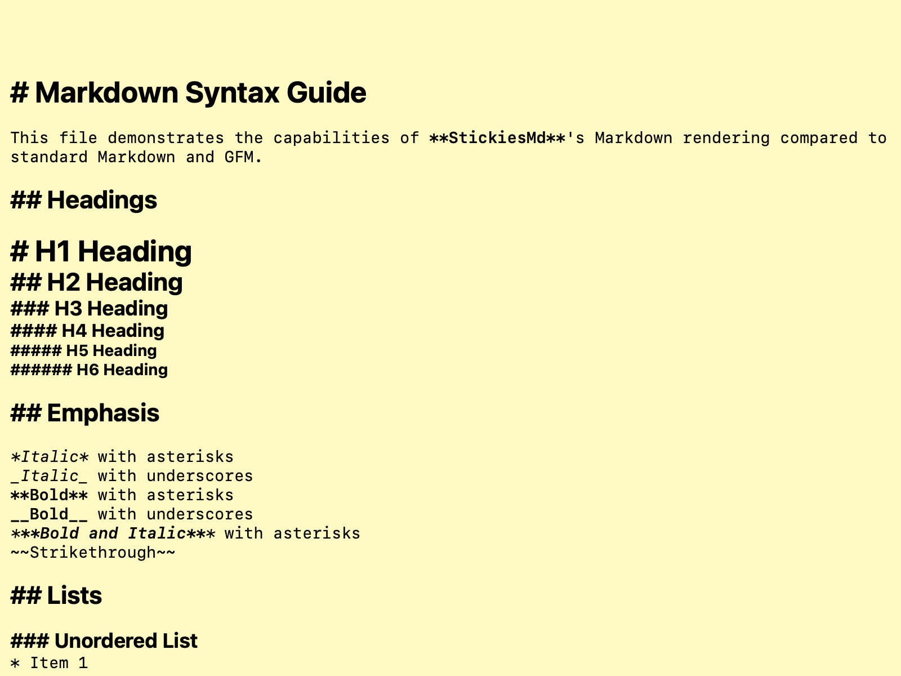

# Markdown Syntax Guide

This file demonstrates the capabilities of **StickiesMd**'s Markdown rendering compared to standard Markdown and GFM.

## Headings

# H1 Heading
## H2 Heading
### H3 Heading
#### H4 Heading
##### H5 Heading
###### H6 Heading

## Emphasis

*Italic* with asterisks
_Italic_ with underscores
**Bold** with asterisks
__Bold__ with underscores
***Bold and Italic*** with asterisks
~~Strikethrough~~

## Lists

### Unordered List
* Item 1
* Item 2
  * Nested Item 2.1
  * Nested Item 2.2
    * Deeply Nested Item 2.2.1
* Item 3

### Ordered List
1. First Item
2. Second Item
   1. Nested Ordered Item
   2. Nested Ordered Item
3. Third Item

### Task List
- [x] Completed task
- [ ] Incomplete task
- [ ] Task with **bold** text

## Blockquotes

> This is a blockquote.
>
> > Nested blockquote.
>
> Back to level 1.

## Code

Inline code: `print("Hello World")`

Code block:

```swift
func hello() {
    print("Hello, World!")
}
```

Code block without language:

```
Simple text block
No syntax highlighting
```

## Links and Images

[Link to Google](https://google.com)





## Horizontal Rule

---

## Tables

| Header 1 | Header 2 | Header 3 |
| :------- | :------: | -------: |
| Left     | Center   | Right    |
| Text     | Text     | Text     |

## Edge Cases

Empty list item:
* 

Mixed styled text:
**Bold** and *Italic* and `Code` in one line.
